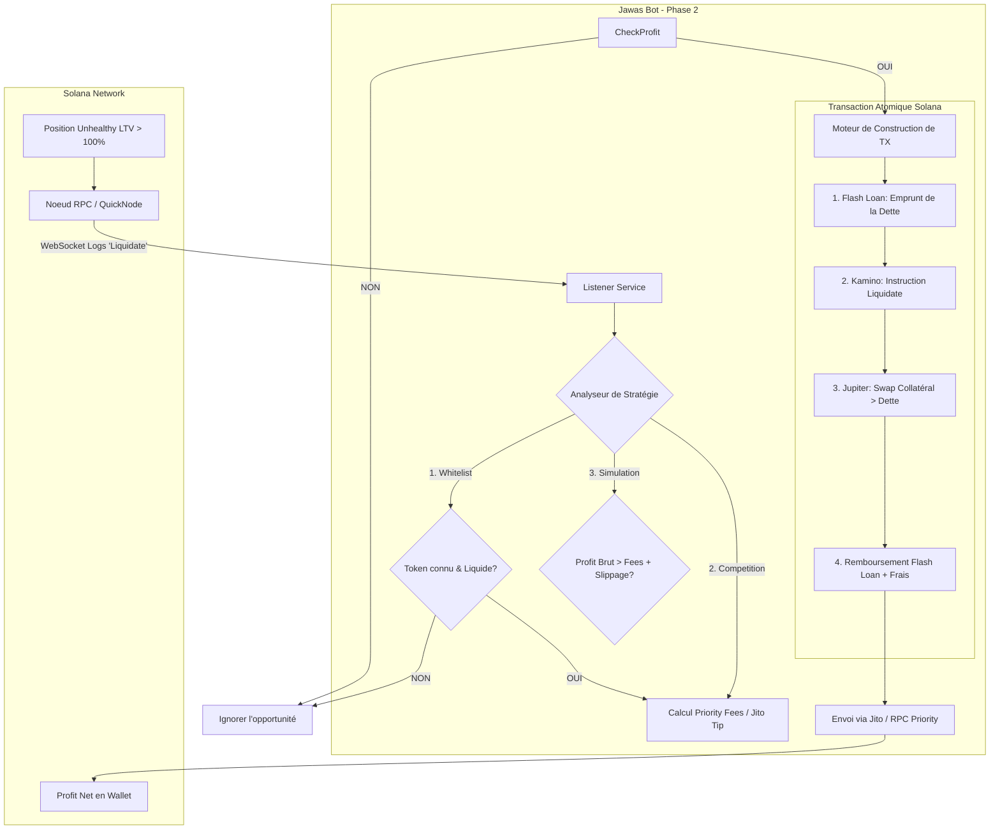

# Phase 2 : Workflow Technique de Liquidation (Hunter Mode)

Ce document décrit le cycle de vie d'une liquidation pour le bot Jawas en Phase 2, depuis le signal blockchain jusqu'au profit net dans le wallet.

## 📊 Diagramme de Flux (Mermaid)

## 📝 Détails des étapes clés

### 1. Le Signal (Déclencheur)

Le bot écoute en continu le flux `subscribe_to_logs` de Kamino. Grâce au filtre élargi `"Liquidate"`, il intercepte les tentatives des autres bots. Dès qu'un signal est reçu, le bot analyse l'état de l'**Obligation** incriminée.

### 2. Analyse de la Concurrence & Fees

* **Estimation :** Le bot utilise l'historique `competing_bots` (Phase 1) pour savoir si cette cible est très disputée.
* **Agressivité :** 
  * *Si concurrence faible :* Utilisation de **Priority Fees** standards (peu coûteux).
  * *Si concurrence forte :* Utilisation d'un **Jito Tip** (pourboire au validateur) pour garantir une place en début de bloc.

### 3. La Transaction Atomique (Flash Loan)

La transaction est envoyée comme un bloc unique. Si une seule étape échoue, rien ne se passe et aucun capital n'est perdu (sauf les frais de transaction si non envoyée via Jito).

* **Flash Loan :** On emprunte par exemple 1000 USDC sur Kamino.
* **Liquidation :** On utilise ces 1000 USDC pour rembourser la dette de la cible. Kamino nous donne 1050 USDC de valeur en SOL.
* **Swap :** On échange immédiatement les SOL contre des USDC via Jupiter.
* **Repay :** On rend les 1000 USDC + 1 USDC de frais de prêt. 
* **Profit :** Il reste 49 USDC nets dans le wallet.

### 4. Optimisation "Surgicale" (Alternative Low-CU)

Pour passer devant les bots utilisant des Flash Loans complexes (gros consommateurs de *Compute Units*), Jawas peut utiliser son **War Chest** :

* Le bot possède déjà les USDC en wallet.
* **TX :** `Liquidate` (Kamino) uniquement.
* **Avantage :** Consomme 10x moins de CU, passe plus vite et coûte moins cher en Priority Fees.
* **Risque :** Le bot doit gérer son propre inventaire de tokens.

---

*Note : Ce document est une base de travail pour l'implémentation du `HunterService`.*
