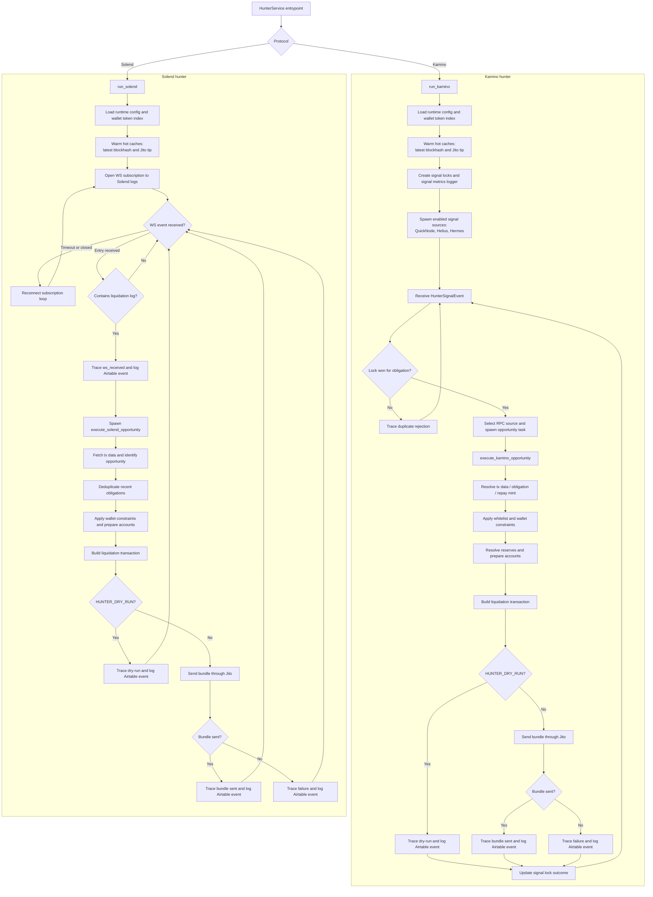

# Hunter Flow

```mermaid
flowchart TD
    A[HunterService entrypoint] --> B{Protocol}
    B -->|Kamino| C[run_kamino]
    B -->|Solend| D[run_solend]

    subgraph K[Kamino hunter]
        C --> K1[Load runtime config and wallet token index]
        K1 --> K2[Warm hot caches:<br/>latest blockhash and Jito tip]
        K2 --> K3[Create signal locks and signal metrics logger]
        K3 --> K4[Spawn enabled signal sources:<br/>QuickNode, Helius, Hermes]
        K4 --> K5[Receive HunterSignalEvent]
        K5 --> K6{Lock won for obligation?}
        K6 -->|No| K7[Trace duplicate rejection]
        K7 --> K5
        K6 -->|Yes| K8[Select RPC source and spawn opportunity task]
        K8 --> K9[execute_kamino_opportunity]
        K9 --> K10[Resolve tx data / obligation / repay mint]
        K10 --> K11[Apply whitelist and wallet constraints]
        K11 --> K12[Resolve reserves and prepare accounts]
        K12 --> K13[Build liquidation transaction]
        K13 --> K14{HUNTER_DRY_RUN?}
        K14 -->|Yes| K15[Trace dry-run and log Airtable event]
        K14 -->|No| K16[Send bundle through Jito]
        K16 --> K17{Bundle sent?}
        K17 -->|Yes| K18[Trace bundle sent and log Airtable event]
        K17 -->|No| K19[Trace failure and log Airtable event]
        K15 --> K20[Update signal lock outcome]
        K18 --> K20
        K19 --> K20
        K20 --> K5
    end

    subgraph S[Solend hunter]
        D --> S1[Load runtime config and wallet token index]
        S1 --> S2[Warm hot caches:<br/>latest blockhash and Jito tip]
        S2 --> S3[Open WS subscription to Solend logs]
        S3 --> S4{WS event received?}
        S4 -->|Timeout or closed| S5[Reconnect subscription loop]
        S5 --> S3
        S4 -->|Entry received| S6{Contains liquidation log?}
        S6 -->|No| S4
        S6 -->|Yes| S7[Trace ws_received and log Airtable event]
        S7 --> S8[Spawn execute_solend_opportunity]
        S8 --> S9[Fetch tx data and identify opportunity]
        S9 --> S10[Deduplicate recent obligations]
        S10 --> S11[Apply wallet constraints and prepare accounts]
        S11 --> S12[Build liquidation transaction]
        S12 --> S13{HUNTER_DRY_RUN?}
        S13 -->|Yes| S14[Trace dry-run and log Airtable event]
        S13 -->|No| S15[Send bundle through Jito]
        S15 --> S16{Bundle sent?}
        S16 -->|Yes| S17[Trace bundle sent and log Airtable event]
        S16 -->|No| S18[Trace failure and log Airtable event]
        S14 --> S4
        S17 --> S4
        S18 --> S4
    end
```
