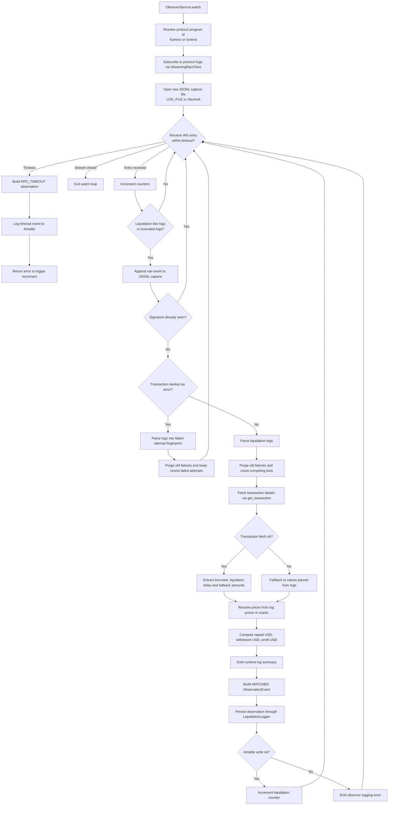

# Observer Flow

```mermaid
flowchart TD
    A[ObserverService.watch] --> B[Resolve protocol program id<br/>Kamino or Solend]
    B --> C[Subscribe to protocol logs via StreamingRpcClient]
    C --> D[Open raw JSONL capture file<br/>LOG_FILE or /dev/null]
    D --> E{Receive WS entry<br/>within timeout?}

    E -->|Timeout| F[Build RPC_TIMEOUT observation]
    F --> G[Log timeout event to Airtable]
    G --> H[Return error to trigger reconnect]

    E -->|Stream closed| I[Exit watch loop]
    E -->|Entry received| J[Increment counters]
    J --> K{Liquidation-like logs<br/>or truncated logs?}
    K -->|No| E
    K -->|Yes| L[Append raw event to JSONL capture]
    L --> M{Signature already seen?}
    M -->|Yes| E
    M -->|No| N{Transaction marked as error?}

    N -->|Yes| O[Parse logs into failed attempt fingerprint]
    O --> P[Purge old failures and keep recent failed attempts]
    P --> E

    N -->|No| Q[Parse liquidation logs]
    Q --> R[Purge old failures and count competing bots]
    R --> S[Fetch transaction details via get_transaction]
    S --> T{Transaction fetch ok?}
    T -->|Yes| U[Extract borrower, liquidator,<br/>delay and fallback amounts]
    T -->|No| V[Fallback to values parsed from logs]

    U --> W[Resolve prices from log prices or oracle]
    V --> W
    W --> X[Compute repaid USD, withdrawn USD, profit USD]
    X --> Y[Emit runtime log summary]
    Y --> Z[Build WATCHED ObservationEvent]
    Z --> AA[Persist observation through LiquidationLogger]
    AA --> AB{Airtable write ok?}
    AB -->|Yes| AC[Increment liquidation counter]
    AB -->|No| AD[Emit observer logging error]
    AC --> E
    AD --> E
```
