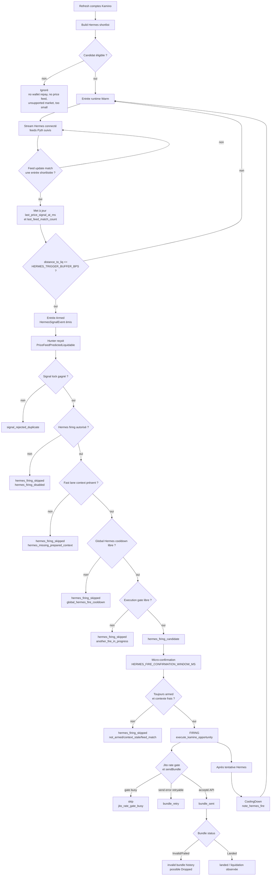
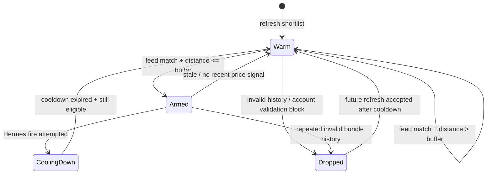

# Hermes firing state machine

Date: 2026-05-15

## Objectif

Ce document décrit le chemin exact qui transforme une obligation Kamino shortlistée en tir Hermes, puis en soumission Jito.

Il complète :

- [Hermes — Price feeds](hermes_explained_for_jawas.md)
- [Hermes v1 — Firing](hermes_hybrid_firing_v1.md)
- [Jito — Décongestion](jito_decongestion_runtime_spec.md)

Le point important est que `armed` ne signifie pas "transaction déjà signée et envoyée". Dans le runtime actuel, `armed` signifie :

> l'obligation est dans la shortlist Hermes, un feed suivi a bougé, la distance à liquidation est dans le seuil `HERMES_TRIGGER_BUFFER_BPS`, et le contexte préparé peut être réutilisé pour tenter un tir rapide.

## Vue d'ensemble



## États Hermes

| État | Signification | Transition principale |
|------|---------------|-----------------------|
| `Warm` | L'obligation est dans la shortlist runtime avec un `prepared_context`, mais aucun signal prix récent ne la rend tirable. | Devient `Armed` si un feed suivi matche et si `distance_to_liq <= HERMES_TRIGGER_BUFFER_BPS`. |
| `Armed` | Un feed Hermes lié à l'obligation a bougé, `last_price_signal_at_ms` est renseigné, et la distance à liquidation est sous le seuil. | Peut produire `PriceFeedPredictedLiquidable`, puis un tir. |
| `CoolingDown` | L'obligation vient d'être utilisée ou invalidée temporairement. | Repassera `Warm` après expiration du cooldown si elle reste shortlistée. |
| `Dropped` | L'entrée est bloquée dans le runtime courant, typiquement après historique invalide ou compte non exploitable. | Peut revenir plus tard si la validation refresh réussit ou si le cooldown expire selon le cas. |

## Construction de la shortlist

Le refresh Hermes lit les comptes Kamino, décode les reserves et obligations, puis garde seulement les obligations compatibles avec le wallet et le marché configuré.

Logs utiles :

```text
hermes shortlist refresh accounts obligations=... reserves=...
hermes shortlist build fresh=... feeds=... eligible=... skipped_...
hermes shortlist runtime active=... feeds=... states=warm=... armed=...
```

Champs à lire :

| Champ | Lecture |
|-------|---------|
| `fresh` | Nombre de candidats construits avant limitation finale à `HERMES_SHORTLIST_SIZE`. |
| `active` | Nombre d'entrées réellement présentes dans le runtime. |
| `feeds` | Nombre de feeds Hermes/Pyth distincts suivis. |
| `top=...:dist=...` | Candidats les plus proches de liquidation. La distance est un ratio : `0.0040` = `40 bps` = `0.40%`. |
| `states=warm=... armed=...` | Photo de la machine d'état au moment du refresh. |

## Passage `Warm -> Armed`

Le passage `Warm -> Armed` ne se fait pas au simple refresh.

Il faut un événement du stream Hermes :

1. le stream reçoit un event Pyth/Hermes ;
2. l'event contient au moins un feed id suivi par une entrée runtime ;
3. le runtime met à jour `last_price_signal_at_ms` ;
4. le runtime compare `distance_to_liq` à `HERMES_TRIGGER_BUFFER_BPS` ;
5. si la distance est sous le seuil, l'entrée passe `Armed` et émet un `HermesSignalEvent`.

Pseudo-code logique :

```rust
if feed_match_count > 0 {
    entry.last_price_signal_at_ms = received_at_ms;
    entry.last_feed_match_count = feed_match_count;

    if entry.distance_to_liq <= config.trigger_buffer_bps {
        entry.state = ShortlistState::Armed;
        emit PriceFeedPredictedLiquidable;
    } else {
        entry.state = ShortlistState::Warm;
    }
}
```

Implication opérationnelle :

- `HERMES_TRIGGER_BUFFER_BPS=40` signifie `0.0040`.
- Une obligation à `dist=0.00414196` est à `41.42 bps`, donc juste au-dessus du seuil.
- Elle ne doit pas armer tant qu'elle ne passe pas sous `40 bps`.

## Passage `Armed -> firing`

Une entrée `Armed` ne garantit pas encore l'envoi Jito. Le hunter applique plusieurs gardes.

| Garde | Variable / source | Skip observé |
|-------|-------------------|--------------|
| Mode runtime | `HERMES_EXECUTION_MODE`, `HERMES_FIRE_ENABLE` | `hermes_firing_disabled` |
| Contexte préparé | `HermesFastLaneContext` | `hermes_missing_prepared_context` |
| Cooldown global Hermes | `HERMES_FIRE_COOLDOWN_MS` | `global_hermes_fire_cooldown` |
| Gate d'exécution local | mutex global de tir | `another_fire_in_progress` |
| Confirmation courte | `HERMES_FIRE_CONFIRMATION_WINDOW_MS` | étape `hermes_firing_candidate` |
| Persistance de l'état | `HERMES_FIRE_REQUIRE_PERSISTENCE` | `hermes_not_armed_anymore` |
| Fraîcheur contexte | `HERMES_FIRE_MAX_CONTEXT_AGE_MS` | `hermes_context_stale` |
| Qualité du match feed | `HERMES_FIRE_MIN_FEED_MATCH_COUNT` | `hermes_feed_match_insufficient` |

Si ces gardes passent, le hunter appelle le chemin normal :

```text
execute_kamino_opportunity
```

Le log attendu est :

```text
FIRING | source=price_feed obligation=... repay=...
```

Dans la trace JSONL, un tir Hermes réussi jusqu'à la construction doit avoir :

```json
"stage": "firing",
"hermes_state": "armed",
"shortlist_state": "armed",
"prepared_context_used": true,
"prepared_context_source": "hermes_shortlist",
"fast_lane_used": true
```

## Passage `firing -> bundle`

Le tir construit la transaction Kamino à partir du contexte préparé :

- obligation ;
- repay reserve ;
- withdraw reserve ;
- token accounts ;
- compute budget ;
- tip Jito ;
- bundle.

Sorties principales :

| Stage / log | Signification |
|-------------|---------------|
| `bundle_sent` | L'API Jito a accepté le bundle. Ce n'est pas une preuve de liquidation. |
| `bundle_retry` | L'envoi a échoué de manière retryable, par exemple congestion. |
| `jito_rate_gate_busy` | Le gate local refuse l'envoi pour éviter une rafale auto-infligée. |
| `bundle_terminal_status` | Résultat pollé côté Jito : `Invalid`, `Failed`, `Landed`, etc. |

Après un tir Hermes non purement erroné, le runtime appelle `note_hermes_fire` et place l'entrée en `CoolingDown`.

## Transitions d'échec



## Variables à calibrer

| Variable | Rôle | Remarque |
|----------|------|----------|
| `HERMES_TRIGGER_BUFFER_BPS` | Seuil d'armement et, dans le code actuel, seuil effectif de tir Hermes. | Ne pas le traiter comme un simple seuil d'observation. |
| `HERMES_ARMED_STALE_MS` | Durée maximale pendant laquelle une entrée reste exploitable après signal prix. | Trop court : skips. Trop long : tirs stale. |
| `HERMES_FIRE_CONFIRMATION_WINDOW_MS` | Petite attente avant de confirmer le tir. | Défaut observé : `120 ms`. |
| `HERMES_FIRE_MAX_CONTEXT_AGE_MS` | Age max du contexte prix confirmé. | Protège contre un signal trop vieux. |
| `HERMES_FIRE_COOLDOWN_MS` | Cooldown global et par entrée après tir Hermes. | Réduit les rafales. |
| `HERMES_FIRE_MIN_FEED_MATCH_COUNT` | Nombre minimum de feeds qui doivent matcher. | Utile pour réduire les faux positifs. |
| `KAMINO_JITO_MIN_SEND_INTERVAL_MS` | Intervalle minimum local entre envois Jito. | Protège contre la congestion auto-infligée. |
| `KAMINO_JITO_SEND_WAIT_BUDGET_MS` | Temps max d'attente si le gate Jito est occupé. | Trop bas : plus de skips ; trop haut : tirs plus tardifs. |

## Lecture opérationnelle rapide

Pour savoir où le pipeline s'arrête, lire dans cet ordre :

1. `hermes shortlist runtime active=... states=...`
   - Si `active=0`, problème de shortlist.
   - Si `armed=0`, regarder les distances et les feed matches.
2. `hermes stream connected status=200 OK`
   - Si absent, problème de stream.
3. `hermes stream matched changed_feeds=... signals=...`
   - Si absent, aucun feed suivi n'a produit de signal exploitable.
4. `hermes_signal_received`
   - Si présent, Hermes a armé au moins une entrée.
5. `hermes_firing_candidate`
   - Si présent, le hunter a accepté d'entrer dans la séquence de tir.
6. `hermes_firing_skipped`
   - Lire `reason`.
7. `FIRING | source=price_feed`
   - Le chemin Kamino a été lancé.
8. `bundle_sent` puis `bundle_terminal_status`
   - Le problème est maintenant dans la couche Jito / inclusion / validité on-chain.

## Limite actuelle

Le runtime utilise `HERMES_TRIGGER_BUFFER_BPS` à la fois pour armer et pour déclencher le signal de tir.

Cela mélange deux intentions différentes :

- suivre/préparer tôt ;
- envoyer seulement quand la liquidation est très proche.

Une amélioration propre serait de séparer :

- `HERMES_ARM_BUFFER_BPS`
- `HERMES_FIRE_BUFFER_BPS`

Tant que cette séparation n'existe pas, `HERMES_TRIGGER_BUFFER_BPS` doit être considéré comme un seuil de firing, pas seulement comme un seuil d'observation.
